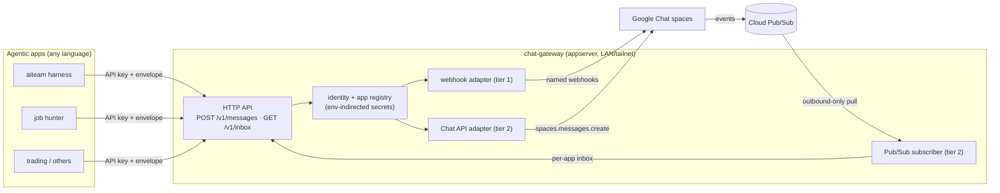

# chat-gateway

First-class **Google Chat identities for agentic applications** — one gateway
that any agent system (dev-team harness, job hunter, trading agents, …) calls
to talk to you in Chat, instead of each app embedding its own webhook/Chat-API
plumbing.

**The dividing line (the rule this repo exists to keep):** the gateway owns
*transport* — identities, delivery, threading, and inbound reply routing.
It never owns an application's message schema. Apps render their own content
(text + Cards v2) and hand it over in a small channel-agnostic envelope.

## Architecture



- **Tier 1 — named webhooks (works today, one-way).** A Chat space holds one
  incoming webhook per identity ("PM · familyworkspace", "Job Hunter", …) —
  display name + avatar set at webhook creation. Zero Google Cloud setup.
- **Tier 2 — the two-way Chat app.** One Google Cloud project, Chat API app,
  events via a **Pub/Sub pull subscription** — outbound-only, so a homelab
  appserver never opens a port. Replies land in per-app inboxes with the
  sender, text, and the `thread_key` the app chose when sending.

## Quickstart (local, no Google Cloud needed)

```bash
pip install -e ".[dev]"
python3 -m pytest                          # 20 tests, fully offline

cp config/registry.example.yaml config/registry.yaml
cp .env.example .env
python3 -m chat_gateway mint-key           # -> put in .env as the app's key
python3 -m chat_gateway check              # registry + env sanity, no secrets printed
python3 -m chat_gateway serve              # http://localhost:8085/docs
```

Send as an app (see [docs/integration-guide.md](docs/integration-guide.md)):

```bash
curl -s localhost:8085/v1/messages \
  -H "Authorization: Bearer $CHAT_GATEWAY_API_KEY__AITEAM_HARNESS" \
  -H "Content-Type: application/json" \
  -d '{"identity":"pm-familyworkspace","text":"Review needed: deploy gate","thread_key":"review-12"}'
```

## API

| Endpoint | What |
|---|---|
| `POST /v1/messages` | Send a raw envelope as a registered identity (synchronous; 403 if the identity isn't allowlisted for your key) |
| `POST /v1/notify` | **Accept-fast notifications** (202 on enqueue): severity routing (`routes:` config), severity rendering (alert = loud card + "What to do"; info = plain), dedupe windows with occurrence counters, async delivery with retries |
| `POST /v1/heartbeat` | **Dead-man checks**: register/refresh; silence past `schedule + grace` fires an alert on your alert route, repeating daily. `weekdays` schedule rolls weekend due-dates to Monday (tz-aware) — no weekend false alarms |
| `GET /v1/heartbeat/{source}` · `DELETE .../{check_id}` | Check states / decommission (own source only) |
| `GET /v1/deliveries` | Per-source delivery log: `enqueued → retrying* → delivered/failed` (+ `deduped`). Titles only, never bodies |
| `GET /v1/inbox` | Poll replies routed to your app (tier 2). Apps with `allow_inbound: false` get a hard 403 — the **no-inbound-control** contract is enforced, and no gateway mechanism ever turns Chat input into a call against a consumer |
| `GET /v1/identities` | The identities your key may use, with readiness |
| `GET /healthz` | **Honest** health: per-identity env resolution, key status, queue depth, heartbeat + subscriber liveness — never a hardcoded OK |
| `GET /docs` | OpenAPI UI |

Two-way tenants can also register a **callback URL**: authorized card
interactions and replies forward whole (action id + params, sender, space,
message/thread ids, an at-least-once dedupe key), with short retries and a
loud in-thread failure notice when the tenant is unreachable. Per-user
authorization allowlists refuse anyone else in-thread. Opt-out
(`allow_inbound: false`) is absolute and validated.

Consumer contracts live in [`docs/consumers/`](docs/consumers/):
[aitrader](docs/consumers/aitrader.md) (notify + dead-man, no-inbound) and
[jobhunt](docs/consumers/jobhunt.md) (two-way cards + callbacks).

## Security model

- Per-app API keys (`Authorization: Bearer`, constant-time compare), minted
  with `python3 -m chat_gateway mint-key`; each app is allowlisted to specific
  identities.
- The committed registry holds **env-var names only**. Webhook URLs (which
  embed `key`+`token`) and API keys live in the runtime env / `.env` (mode
  600); the service never logs them.
- Tier 2 uses one service account; its JSON key stays on the host, pointed at
  by `GOOGLE_APPLICATION_CREDENTIALS`.

## Google Cloud setup (tier 2)

Step-by-step instructions + what can be scripted: **[docs/google-cloud-setup.md](docs/google-cloud-setup.md)**.
Automation: [`iac/gcloud-setup.sh`](iac/gcloud-setup.sh) (idempotent gcloud
script), [`iac/gcloud-setup.ps1`](iac/gcloud-setup.ps1) (same steps on Windows,
where Git Bash mangles slash-bearing gcloud args and `chmod` cannot restrict
the key), or [`iac/terraform/`](iac/terraform/) — the one console-only part is
the Chat app's Configuration page (no API/Terraform surface for it).

## Deploy

`Dockerfile` + `docker-compose.yml`; intended home is `/srv/chat-gateway/` on
an always-on Docker host with `.env` off-repo (mode 600) — LAN/tailnet only,
no reverse-proxy exposure needed (Pub/Sub is outbound pull).

## Status — honest seams

Fully built and tested offline: envelope, registry, auth, inboxes, all three
adapters' logic, the HTTP surface, the client. Flag status is per-seam and lives
in the docstrings — `CLAUDE.md` carries the authoritative list; this is the
summary:

| Seam | Status |
|---|---|
| **Webhook send** (tier 1) | ✅ **verified** 2026-07-29, re-confirmed 2026-07-30 through the real `WebhookAdapter`. Success path only — the non-200 and transport-error branches are still unexercised. The threadKey param-vs-body question is settled: both work, we send the body form. |
| **Chat API send** (tier 2) | ⚠ `LIVE-UNVERIFIED` — see queue item CG-5. |
| **Pub/Sub pull / ack** | ⚠ `LIVE-UNVERIFIED` in the committed docstring — see queue item CG-24. |

**Tier 1 does not depend on any Cloud project.** A webhook URL is issued by the
space, so no tier-2 change — migration, project deletion, credential rotation,
subscription breakage — can take the notification path down. Observed
2026-07-30: all four webhook identities delivered through the real adapter
immediately after a Cloud project was deleted.

First consumers and the tier model trace back to the aiteam plan (F14/F19).

## License

MIT — see [LICENSE](LICENSE).
