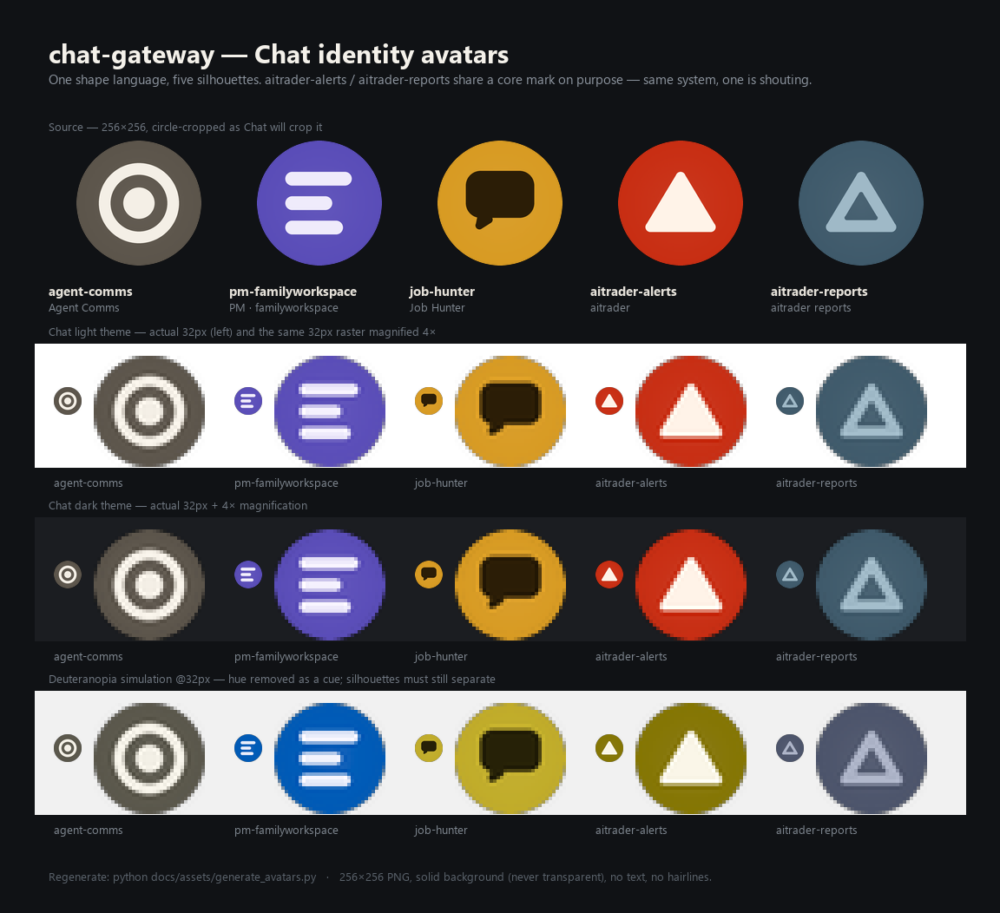

# Chat identity avatars

Avatars for the Google Chat identities this gateway sends as.

The gateway's premise is *several distinct identities posting into the same
Chat spaces*. The avatar is the primary affordance for telling those senders
apart at a glance — if they aren't instantly separable, you end up reading the
sender name off every message and the product loses its main benefit. These
are designed for recognition at 32px, not for decoration at 256px.



## The set

| File | Identity | Where it's configured | Mark | Plate |
|---|---|---|---|---|
| `avatar-agent-comms.png` | **the tier-2 Chat app itself** — named `Chat Gateway` since 2026-07-31, `Agent Comms` before that | Chat API → Configuration → *Avatar URL* ([google-cloud-setup.md](../google-cloud-setup.md) step 5) | hub: ring + core | `#5C554B` warm graphite |
| `avatar-pm-familyworkspace.png` | **PM · familyworkspace** (`pm-familyworkspace`) | webhook creation, [setup step 7](../google-cloud-setup.md) | plan: three ragged bars | `#5A4DB8` indigo |
| `avatar-job-hunter.png` | **Job Hunter** (`job-hunter`) | webhook creation, [setup step 7](../google-cloud-setup.md) | prompt: speech bubble | `#D89B23` amber |
| `avatar-aitrader-alerts.png` | **aitrader** loud lane (`aitrader-alerts`) | webhook creation, [setup step 7](../google-cloud-setup.md) | spike: solid triangle | `#C82E13` vermilion |
| `avatar-aitrader-reports.png` | **aitrader reports** quiet lane (`aitrader-reports`) | webhook creation, [setup step 7](../google-cloud-setup.md) | spike: hollow triangle | `#3F5A6B` slate |

> **Note on `agent-comms`.** It is *not* an entry in
> [`config/registry.example.yaml`](../../config/registry.example.yaml) — the
> four registry identities are the other rows. `agent-comms` is the tier-2
> Chat **app**, which takes its own avatar URL in the Cloud console. It is the
> house mark: the parent the registry identities belong to.
>
> **The app's display name changed on 2026-07-31; the filename deliberately did
> not.** Per a user statement about the console, `Agent Comms` is deprecated and
> the live app is named `Chat Gateway`
> ([google-cloud-setup.md](../google-cloud-setup.md) step 6). The file stays
> `avatar-agent-comms.png` because **the raw GitHub URL below is what Google
> fetches** — renaming it would 404 the live app's avatar until somebody pasted a
> new URL into the console. `agent-comms` is a stable asset slug here, not a
> claim about the app's current name.

## Public URLs

Google Chat fetches avatars over the public internet — it cannot reach a LAN
or tailnet host, so the URL must be publicly resolvable. This repo is public,
so raw GitHub URLs work directly:

```
https://raw.githubusercontent.com/mmackelprang/chat-gateway/main/docs/assets/avatar-agent-comms.png
https://raw.githubusercontent.com/mmackelprang/chat-gateway/main/docs/assets/avatar-pm-familyworkspace.png
https://raw.githubusercontent.com/mmackelprang/chat-gateway/main/docs/assets/avatar-job-hunter.png
https://raw.githubusercontent.com/mmackelprang/chat-gateway/main/docs/assets/avatar-aitrader-alerts.png
https://raw.githubusercontent.com/mmackelprang/chat-gateway/main/docs/assets/avatar-aitrader-reports.png
```

These are plain public asset URLs — no secrets, nothing key- or token-bearing.
(Unlike webhook URLs, which embed `key` + `token` and live only in the runtime
env. See CLAUDE.md hard rule #2.)

Chat caches avatars aggressively. If you change a mark, expect the old one to
linger; re-saving the webhook/app config is the usual nudge.

## Constraints these are built to

Everything below is a hard constraint, not a preference. The generator asserts
the geometric ones and refuses to emit an asset that violates them.

- **256×256 square PNG.** The exported source size.
- **Chat renders them as ~32–40px circles.** 32px is the real design target.
  Every mark here was rendered at 32px and inspected; anything that turned to
  mush was redesigned (see *What changed and why* below).
- **Circular crop.** Chat crops the square to its inscribed circle, so corners
  are thrown away. All ink stays inside a centred safe circle of r=108
  (the r=128 crop, minus a 20px margin). `assert_safe()` enforces this and
  accounts for corner/cap rounding pushing real ink past a nominal vertex.
- **Solid background, never transparent.** A transparent PNG disappears
  against Chat's dark-mode surface. All five are `mode=RGB` with opaque
  corners — verified, not assumed.
- **No text, no lettering, no hairlines.** One bold glyph each. The minimum
  feature size (bar height, ring wall, inter-shape gap) is ≥24px at 256, so
  nothing lands under ~3px at 32px.
- **Legible on both Chat themes.** Each plate is checked for contrast against
  the light (`#FFFFFF`) and dark (`#1B1D21`) surfaces.

## Design rationale

**One shape language.** Same canvas, same safe circle, same corner softness,
comparable ink coverage per mark, and a plate that is always a solid field
with a barely-there centre lift. They should read as five members of one
product, not five stock icons.

**Distinct silhouette per identity** — because hue alone is not allowed to be
the separator:

- `agent-comms` — **hub** (ring + core). The only mark with a hole in a
  circular form. It is the parent everything routes through, which is
  literally what the gateway is. Deliberately the only *achromatic* plate:
  the house mark is the least colourful, most neutral thing in the set.
  Band widths are unequal (core 32 / gap 26 / wall 24) so it reads as a
  core-in-orbit rather than an evenly-banded bullseye.
- `pm-familyworkspace` — **plan** (three left-aligned bars, ragged right). The
  airiest silhouette in the set and the only one with no solid mass: dominant
  horizontal striping is unmistakable even when everything else is lost.
- `job-hunter` — **prompt** (speech bubble with a heavy pennant tail). The only
  two-way tenant, so it is the only mark that says "this one is talking to you
  and expects an answer." It is also the only **inverted-polarity** plate (dark
  mark on a light amber field) and the brightest plate — the identity that
  needs a reply is the one allowed to pull the eye.
- `aitrader-alerts` — **spike, solid.** A bare up-tick with nothing holding it
  down. Maximum ink, hot vermilion plate. This lane is allowed to shout.
- `aitrader-reports` — **spike, hollow.** The *same* triangle at the *same*
  coordinates, drained of ink.

### The aitrader sibling pair

`aitrader-alerts` and `aitrader-reports` are one consumer split only by
severity routing, so they must read as obviously the same system. They share
the core mark **by construction, not by resemblance** — both call
`_spike_pts(**SPIKE)` with one set of coordinates, so the silhouettes cannot
drift apart when the palette is tweaked.

They are then separated three ways at once, so no single failed channel makes
them confusable:

1. **Ink** — solid vs hollow. Reads as loud vs quiet, and survives losing
   colour entirely.
2. **Temperature** — vermilion `#C82E13` vs slate `#3F5A6B`. Hot vs cool.
3. **Internal contrast** — ~5.0:1 vs ~3.6:1. The quiet lane is literally
   quieter against its own plate.

An earlier version differentiated `reports` with a baseline rule under the
triangle. It was cut: at 32px it read unmistakably as the **eject symbol**,
which is a bad thing for a reports lane to look like.

### Holding up without colour

Roughly 8% of men have a red-green colour vision deficiency, so the set must
not lean on hue. `--verify` renders Viénot/Brettel/Mollon deuteranope and
protanope simulations at 32px; the contact sheet carries the deuteranopia row
so this is judged, not asserted.

- **Silhouette is the primary separator.** Ring / bars / bubble / solid
  triangle / hollow triangle stay distinct with hue fully removed. This is the
  load-bearing channel.
- **Greyscale plate luminance is *not* relied upon.** The closest plate pair
  (`agent-comms` vs `aitrader-reports`, ΔL ≈ 0.002) is effectively identical
  in greyscale — they separate on silhouette (ring vs hollow triangle) and on
  warm-neutral vs blue, which survives red-green CVD because the blue channel
  is intact.
- **Known convergence, accepted.** Under both simulations `job-hunter` (amber)
  and `aitrader-alerts` (vermilion) both shift toward olive. They stay
  separable on three other channels: luminance (ΔL ≈ 0.24 — job-hunter is much
  lighter), silhouette (bubble vs triangle), and polarity (dark mark vs light
  mark). This is documented rather than hidden.

### What changed and why (32px failures caught in review)

- `aitrader-reports` triangle-plus-baseline-rule → **hollow triangle**: the
  original read as the eject symbol.
- `agent-comms` and `job-hunter` marks **reduced in size**: at 32px the mark
  had swallowed the plate, leaving the hue — the fastest cue at that size —
  as a thin rim. Ink coverage is now comparable across all five.
- `agent-comms` plate lightened `#514B44` → `#5C554B`: the original held only
  1.96:1 against Chat's dark surface, so the plate edge vanished and the mark
  appeared to float.
- `pm-familyworkspace` bars and the `job-hunter` bubble were **re-fitted to the
  safe circle** after `assert_safe()` caught real clipping.

## Regenerating

```bash
python docs/assets/generate_avatars.py            # writes the 5 PNGs + contact sheet
python docs/assets/generate_avatars.py --verify   # + metrics and 32px/CVD inspection rasters
```

Use `python`, not `python3` — on the dev box the msys `python3` lacks Pillow.
Pillow is the only dependency (built against 12.1.1).

`--verify` prints plate luminance, mark contrast, pairwise greyscale
separation and per-theme edge contrast, and dumps every mark at 32px plus
8× magnifications and both CVD simulations into `docs/assets/_verify/`
(gitignored — it is a review aid, not an asset).

The palette and every glyph's geometry sit at the top of
[`generate_avatars.py`](generate_avatars.py) as legible config. Change a hex
value or a coordinate and re-run; **re-check the 32px row of the contact sheet
before committing**, since that is where these designs actually live.
